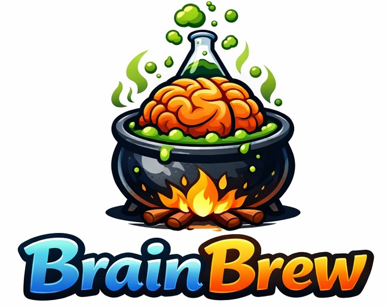
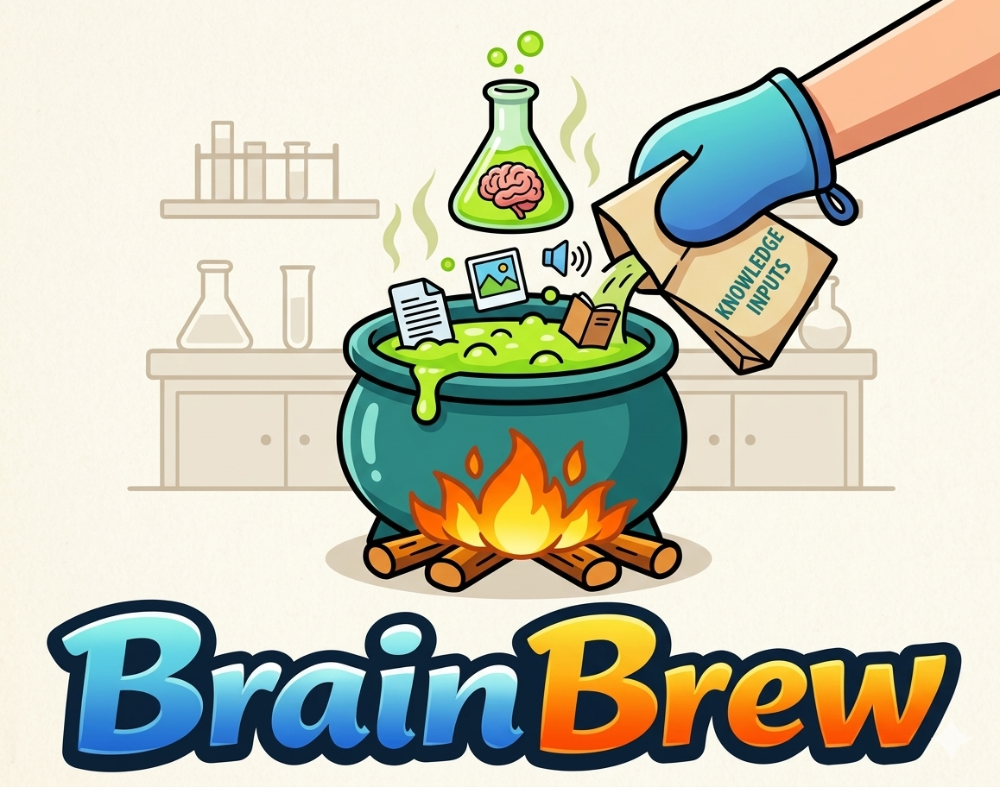
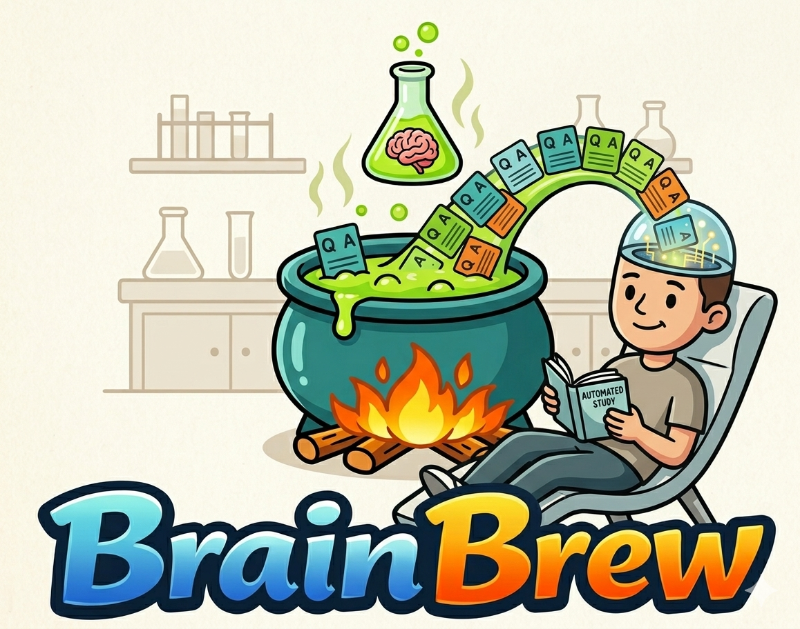
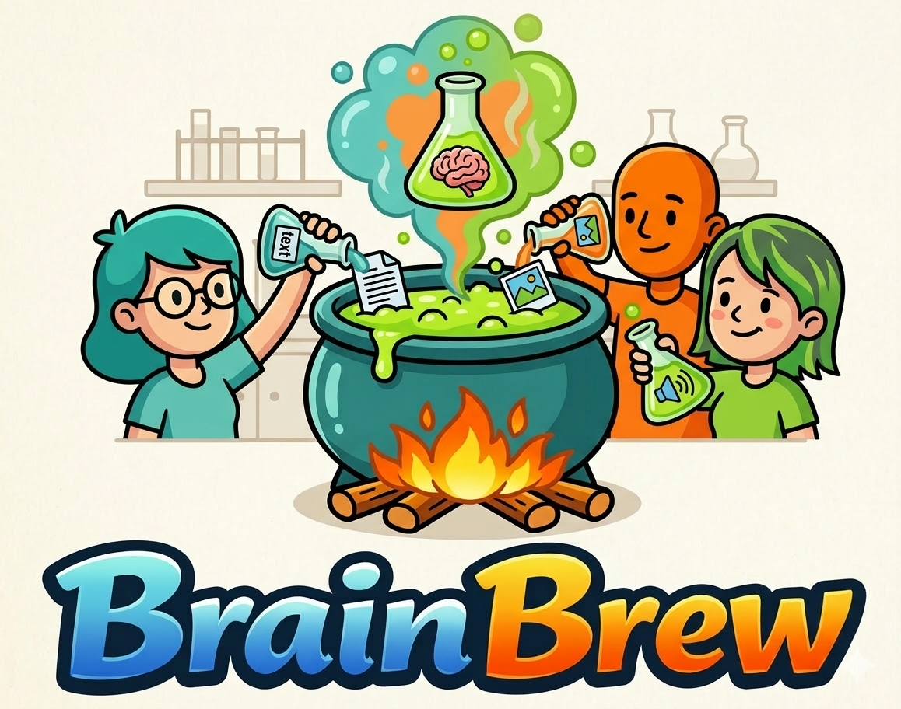

  
  <h1>Brainbrew</h1>
  
<strong>The ridiculously easy, stupidly powerful no-code machine that turns your boring PDFs and TXT files into god-tier synthetic LLM training data</strong>

  

    
    
    
    
    
    
    
  

    
    
    

<strong>Brainbrew</strong> — Think of it like a mad scientist + coffee machine combo: you dump in documents, hit one button, and <strong>BOOM</strong> — fresh, high-quality instruction datasets appear like magic. No coding. No spreadsheets. No crying over JSON formatting at 3 a.m.

We took the original prototype, <strong>slayed every bug</strong>, switched to production-grade distilabel magic, added semantic chunking, multi-model ensemble, dataset deduplication, quality scoring, progress bars, Docker, and a bunch of other goodies… then wrapped it in a shiny Streamlit UI that even your grandma could use.

<strong>Current version: v1.2.0</strong>

  
  
<em>Drop in any knowledge — PDFs, text, books, docs — and let Brainbrew do the rest.</em>

<h2>Why Brainbrew Slaps</h2>
<ul>
  <li><strong>Zero coding</strong> — literally just upload files and click "Generate Dataset"</li>
  <li><strong>Distilabel-powered evolution</strong> — Evol-Instruct with configurable evolution depth</li>
  <li><strong>Multi-model ensemble</strong> — comma-separate your models for diverse, high-quality output</li>
  <li><strong>Semantic chunking</strong> — paragraph-aware document splitting that respects topic boundaries</li>
  <li><strong>Dataset deduplication</strong> — exact-match + near-duplicate removal via shingle Jaccard</li>
  <li><strong>Quality scoring</strong> — SUPER / GOOD / NORMAL / BAD / DISASTER grades after generation</li>
  <li><strong>4 export formats</strong> — Alpaca, ShareGPT, ChatML, and OpenAI fine-tuning JSONL</li>
  <li><strong>vLLM or OpenAI</strong> — choose speed (GPU) or zero-setup (API)</li>
  <li><strong>Auto LoRA training</strong> — optional one-click fine-tune with Unsloth</li>
  <li><strong>Hugging Face publish</strong> — one checkbox and your dataset is live on the Hub</li>
  <li><strong>Resume support</strong> — crashed runs resume from the last completed batch</li>
  <li><strong>Error handling &amp; progress bars</strong> — because crashes are for amateurs</li>
  <li><strong>Docker ready</strong> — run it anywhere without summoning the dependency demon</li>
  <li><strong>132+ automated tests</strong> — full CI/CD with pytest, ruff, and mypy</li>
</ul>

In short: it's what every AI guy <em>wanted</em> and never found anywhere.

<h2>Features</h2>
<ul>
  <li><strong>Quality Modes</strong>: Fast (cheap &amp; quick), Balanced (sweet spot), Research (maximum brain juice)</li>
  <li><strong>Output Formats</strong>: Alpaca, ShareGPT, ChatML, OpenAI — pick what your training framework needs</li>
  <li><strong>Smart Filtering</strong>: Automatic refusal cleaning + quality scoring dashboard</li>
  <li><strong>Multi-Model Ensemble</strong>: Split prompts across multiple teacher models for diversity</li>
  <li><strong>Deduplication</strong>: Exact hash + near-duplicate Jaccard filtering</li>
  <li><strong>Cost Estimator</strong>: See estimated cost and time before you click Generate</li>
  <li><strong>Live Stats</strong>: Record count, average output length, uniqueness ratio</li>
  <li><strong>Dataset Preview</strong>: See the first 5 examples before downloading</li>
  <li><strong>Checkpoint/Resume</strong>: Large runs save state for crash recovery</li>
  <li><strong>Pydantic Config</strong>: Type-safe everything (no more surprise crashes)</li>
</ul>

<h2>Quick Start (Takes 2 Minutes)</h2>

<h3>1. Clone &amp; Setup</h3>
<pre><code>git clone https://github.com/Yog-Sotho/Brainbrew.git
cd Brainbrew</code></pre>

<h3>2. Run the installer (Python 3.12+)</h3>
<pre><code>bash install.sh</code></pre>

The installer handles everything: Python version check, virtual environment, pip dependencies, GPU detection, and <code>.env</code> setup.

<h3>3. Or install manually</h3>
<pre><code>python3.12 -m venv .venv
source .venv/bin/activate
pip install -r requirements.txt
cp .env.sample .env</code></pre>

Edit <code>.env</code>:

<pre><code>OPENAI_API_KEY=sk-...
HF_TOKEN=hf_...
HF_USERNAME=yourusername</code></pre>

<h3>4. Run It</h3>
<pre><code>streamlit run app.py</code></pre>

<strong>Boom.</strong> Browser opens. You're now a dataset wizard.

<h2>Docker (For the Cool Kids)</h2>
<pre><code>docker build -t brainbrew .
docker run --gpus all -p 8501:8501 --env-file .env brainbrew</code></pre>

Or use the installer:

<pre><code>bash install.sh --docker</code></pre>

Open <code>http://localhost:8501</code> and flex.

<h2>How to Use (So Easy It's Embarrassing)</h2>
<ol>
  <li>Upload your PDFs or TXT files (multiple OK!)</li>
  <li>Pick your teacher model (GPT-4o for API, or Llama-3.1-8B for vLLM speed)</li>
  <li>Optionally enter multiple models comma-separated for ensemble diversity</li>
  <li>Choose quality mode (Fast / Balanced / Research)</li>
  <li>Choose output format (Alpaca / ShareGPT / ChatML / OpenAI)</li>
  <li>Slide to desired dataset size</li>
  <li>Optional: enable semantic chunking, deduplication, LoRA training, HF publish</li>
  <li>Smash the big <strong>Generate Dataset</strong> button</li>
  <li>Check your quality score, preview examples, and download</li>
</ol>

Done. Go train a model that actually knows your niche.

  
  
<em>High-quality Q&amp;A pairs stream straight into your model's brain. Automated study, zero effort.</em>

<h2>Advanced Settings (Sidebar)</h2>
<ul>
  <li><strong>Use vLLM</strong> — Lightning fast (needs 24+ GB VRAM)</li>
  <li><strong>OpenAI API Key</strong> — fallback for laptop warriors</li>
  <li><strong>HF Token</strong> — for publishing</li>
  <li><strong>Semantic Chunking</strong> — paragraph-aware splitting (experimental)</li>
  <li><strong>Deduplication</strong> — remove near-duplicate instruction/output pairs</li>
  <li>Temperature, LoRA rank, batch size — smart-defaulted but tweakable</li>
</ul>

<h2>Tech Stack</h2>
<ul>
  <li><strong>Streamlit</strong> – beautiful UI</li>
  <li><strong>distilabel 1.5.x</strong> – the real MVP (Evol-Instruct + generation + filtering)</li>
  <li><strong>vLLM</strong> – GPU wizardry</li>
  <li><strong>Unsloth</strong> – fastest LoRA training on the planet</li>
  <li><strong>LangChain text splitters</strong> – character &amp; semantic chunking</li>
  <li><strong>Pydantic + Structlog</strong> – no more "it worked on my machine" excuses</li>
  <li><strong>pytest</strong> – 132+ tests with CI/CD via GitHub Actions</li>
</ul>

<h2>Hardware Requirements</h2>
<table>
  <thead>
    <tr>
      <th>Mode</th>
      <th>GPU Needed?</th>
      <th>Speed</th>
      <th>Cost</th>
    </tr>
  </thead>
  <tbody>
    <tr>
      <td>OpenAI API</td>
      <td>None</td>
      <td>Medium</td>
      <td>$$ (API)</td>
    </tr>
    <tr>
      <td>vLLM (8B)</td>
      <td>24 GB+ VRAM</td>
      <td>Blazing</td>
      <td>Free</td>
    </tr>
    <tr>
      <td>LoRA training</td>
      <td>8 GB+ VRAM</td>
      <td>Fast</td>
      <td>Free</td>
    </tr>
  </tbody>
</table>

<em>Pro tip: Start with OpenAI mode. Once it works, flex with vLLM on RunPod/Modal.</em>

<h2>Troubleshooting</h2>
<ul>
  <li><strong>"CUDA out of memory"</strong> — Turn off vLLM or use smaller model</li>
  <li><strong>OpenAI rate limit</strong> — Chill, use smaller batch or wait</li>
  <li><strong>Nothing happens</strong> — Check console + make sure you uploaded files</li>
  <li><strong>HF publish fails</strong> — Token wrong? Repo name taken? Classic.</li>
  <li><strong>bitsandbytes error</strong> — Needs CUDA. Expected on CPU-only machines.</li>
</ul>

Still stuck? Open an issue. We'll roast the bug together.

<h2>Testing</h2>

Brainbrew ships with 132+ automated tests covering config validation, security (API key leakage, filename sanitisation), pipeline orchestration, exporter formats, LoRA training, HF publishing, and more. No GPU required to run tests.

<pre><code># Install test deps
pip install pytest

# Run all tests
pytest tests/ -v

# Run just security tests
pytest tests/test_security.py -v</code></pre>

CI runs automatically on every push and PR via GitHub Actions.

<h2>Contributing</h2>

  
  
<em>Every great dataset starts with great contributors. Jump in — the cauldron is warm.</em>

Love it? Want to make it even cooler?

<ol>
  <li>Fork it</li>
  <li>Make changes (we love clean PRs)</li>
  <li>Run <code>pytest tests/ -v</code> and make sure everything passes</li>
  <li>Submit PR</li>
</ol>

Ideas welcome: RAG retrieval, multi-modal support, web UI for cloud, additional export formats, etc.

<h2>License</h2>

MIT — do whatever you want. Just don't blame us if your model becomes too powerful and takes over the world.

  
  <h2>Now go brew some brains.</h2>
  
<strong>Made with chaos, coffee, and zero patience for bad datasets.</strong>

  
<em>Star the repo if it saved you 20 hours this week. You know you want to.</em>

  Yog-Sotho

