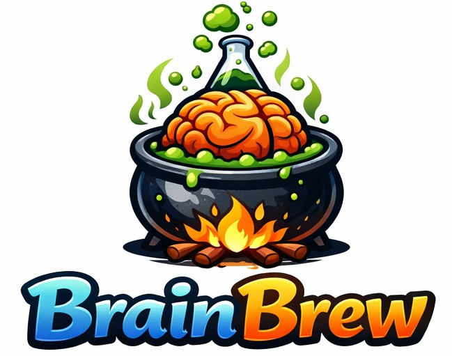
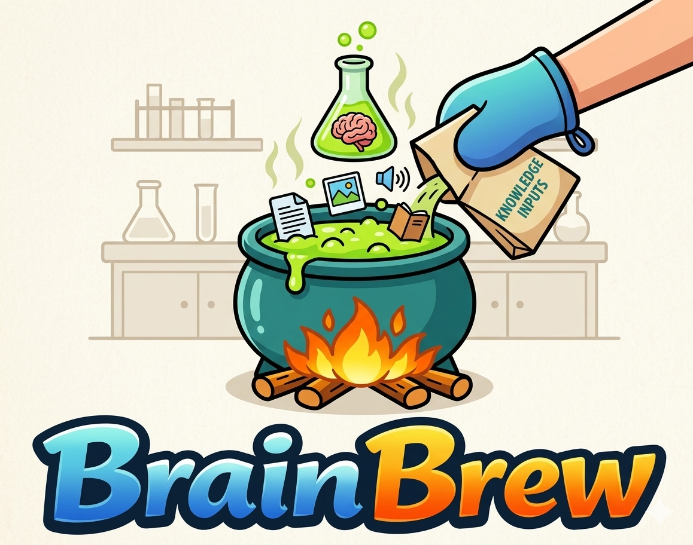
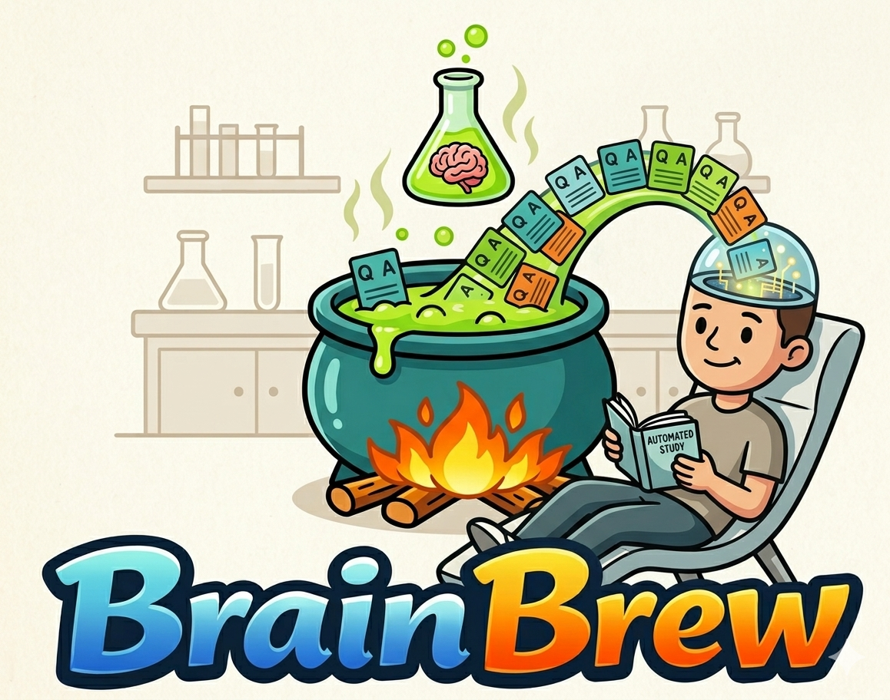
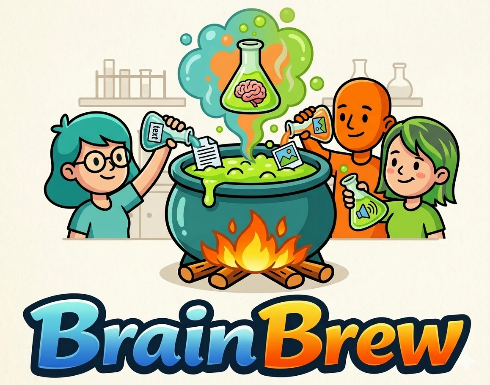

  
  <h1>Brainbrew</h1>
  
<strong>The ridiculously easy, stupidly powerful no-code machine that turns your boring PDFs and TXT files into god-tier synthetic LLM training data</strong>

  

    
    
    
    
    
    
    
    
  

    
    
    

<strong>Brainbrew</strong> — Think of it like a mad scientist + coffee machine combo: you dump in documents, hit one button, and <strong>BOOM</strong> — fresh, high-quality instruction datasets appear like magic. No coding. No spreadsheets. No crying over JSON formatting at 3 a.m.

We took the original prototype, <strong>slayed every bug</strong>, rebuilt generation so every answer is grounded in your documents and checked by an LLM judge, added semantic chunking, multi-model ensemble, near-duplicate and paraphrase removal, benchmark decontamination, PII scrubbing, quality scoring, progress bars, Docker, and a bunch of other goodies… then wrapped it in a shiny Streamlit UI that even your grandma could use.

<strong>Current version: v2.0.0</strong>

  
  
<em>Drop in any knowledge — PDFs, text, books, docs — and let Brainbrew do the rest.</em>

<strong>Docs:</strong> the <a href="docs/index.md">documentation</a> lives in <code>docs/</code> as Markdown; browse it locally with <code>uv run --group docs mkdocs serve</code>.

<h2>Why Brainbrew Slaps</h2>
<ul>
  <li><strong>Zero coding</strong> — literally just upload files and click "Generate Dataset"</li>
  <li><strong>Grounded Q&amp;A</strong> — the model writes several kinds of questions per passage (factual, conceptual, procedural, comparative, multi-hop) and answers each one from that passage only</li>
  <li><strong>LLM judge</strong> — Balanced and Research mode score every pair for faithfulness, helpfulness and correctness and keep only the good ones</li>
  <li><strong>Real target size</strong> — Brainbrew keeps generating until it reaches the number you asked for (or your documents run out), and tells you up front what your documents can support</li>
  <li><strong>Multi-model ensemble</strong> — comma-separate your models for diverse, high-quality output</li>
  <li><strong>Semantic chunking</strong> — paragraph-aware document splitting that respects topic boundaries</li>
  <li><strong>Dataset deduplication</strong> — near-duplicates via MinHash-LSH, plus optional paraphrase removal with an embedding model</li>
  <li><strong>Benchmark decontamination</strong> — optionally drop pairs that overlap GSM8K, MMLU, ARC, TruthfulQA or HumanEval</li>
  <li><strong>Quality scoring</strong> — SUPER / GOOD / NORMAL / BAD / DISASTER grades after generation</li>
  <li><strong>4 export formats</strong> — Alpaca, ShareGPT, ChatML, and OpenAI fine-tuning JSONL</li>
  <li><strong>Any OpenAI-compatible endpoint</strong> — OpenAI, a local <code>vllm serve</code>, Ollama, llama.cpp or your own URL; fully async with retries and parallel requests</li>
  <li><strong>Auto LoRA training</strong> — optional one-click fine-tune with TRL + PEFT (QLoRA on NVIDIA GPUs)</li>
  <li><strong>Hugging Face publish</strong> — one checkbox and your dataset is on the Hub (private by default) with an auto-generated dataset card; the LoRA adapter can go up too, with a model card</li>
  <li><strong>Runs in the background</strong> — close or reload the tab and the run keeps going; follow it live, cancel it, or find it later on the <em>Run history</em> page</li>
  <li><strong>Every run is kept</strong> — dataset, adapter, rejected pairs, a log and a manifest (models, seed, token usage, actual cost, stage timings, every filter count) land in <code>runs/&lt;run-id&gt;/</code></li>
  <li><strong>Headless CLI</strong> — <code>brainbrew run docs/*.pdf --config cfg.yaml</code> for scripts and servers, same pipeline as the UI</li>
  <li><strong>Error handling &amp; progress bars</strong> — failures are shown in the UI and recorded in the run manifest</li>
  <li><strong>Docker ready</strong> — run it anywhere without summoning the dependency demon</li>
  <li><strong>~540 automated tests</strong> — the real pipeline against an in-memory model server, and real LoRA training, run in CI on every PR; a nightly benchmark checks generation quality with a real model</li>
</ul>

In short: it's what every AI guy <em>wanted</em> and never found anywhere.

<h2>Features</h2>
<ul>
  <li><strong>Quality Modes</strong>: Fast (filters only, cheap &amp; quick), Balanced (+ LLM judge, the sweet spot), Research (+ harder evolved questions, still checked against the source)</li>
  <li><strong>Output Formats</strong>: Alpaca, ShareGPT, ChatML, OpenAI — pick what your training framework needs</li>
  <li><strong>Clean &amp; sanitize</strong>: PII redaction (emails, phones, Luhn-checked cards, IBANs, IPs, links; optional Presidio for names), HTML cleanup and quality gates, applied the same way to every export format</li>
  <li><strong>Refusal filter</strong>: "As an AI…" answers, non-answers and prompt leaks never reach your dataset</li>
  <li><strong>Quality dashboard</strong>: grade, record count, answer length and uniqueness after every run</li>
  <li><strong>Multi-Model Ensemble</strong>: Split prompts across multiple teacher models for diversity</li>
  <li><strong>Deduplication</strong>: MinHash near-duplicates (fast enough for tens of thousands of pairs) + optional embedding-based paraphrase removal</li>
  <li><strong>Cost &amp; yield estimator</strong>: See estimated cost, and how many pairs your documents can support, before you click Generate</li>
  <li><strong>Live Stats</strong>: Record count, average output length, uniqueness ratio</li>
  <li><strong>Dataset Preview</strong>: See the first 5 examples before downloading</li>
  <li><strong>Pydantic Config</strong>: Type-safe everything (no more surprise crashes)</li>
</ul>

<h2>Quick Start (Takes 2 Minutes)</h2>

<h3>1. Clone &amp; Setup</h3>
<pre><code>git clone https://github.com/Yog-Sotho/Brainbrew.git
cd Brainbrew</code></pre>

<h3>2. Run the installer (Python 3.12+)</h3>
<pre><code>bash install.sh</code></pre>

The installer handles everything: Python version check, virtual environment, pip dependencies, GPU detection, and <code>.env</code> setup.

<h3>3. Or install manually</h3>

Dependencies are locked in <code>uv.lock</code>. Add the extras you need:

<pre><code># with uv (recommended)
uv sync                    # core: any OpenAI-compatible endpoint, any OS
uv sync --extra vllm       # + `vllm serve`, a local GPU model server (Linux, NVIDIA)
uv sync --extra train      # + LoRA training with TRL + PEFT (an NVIDIA GPU for real models)
uv sync --extra vllm --extra train   # both
uv sync --extra pii        # + Presidio name detection (then: python -m spacy download en_core_web_lg)

# or with pip (hash-pinned exports of the same lock)
python3.12 -m venv .venv &amp;&amp; source .venv/bin/activate
pip install --require-hashes -r requirements.txt          # or requirements-vllm.txt / -train.txt / -gpu.txt (both)
cp .env.sample .env</code></pre>

Edit <code>.env</code>:

<pre><code>OPENAI_API_KEY=sk-...
HF_TOKEN=hf_...
HF_USERNAME=yourusername</code></pre>

<h3>4. Run It</h3>
<pre><code>streamlit run app.py</code></pre>

Or without a browser:

<pre><code>brainbrew run notes.pdf --model gpt-4o-mini --size 200 --format sharegpt -o dataset.jsonl
brainbrew run docs/*.pdf --config cfg.yaml     # any setting, YAML or JSON; secrets stay in the environment
brainbrew runs list                            # recent runs (web and CLI share the runs folder)
brainbrew runs show &lt;run-id&gt;                  # the full manifest</code></pre>

Ctrl-C cancels a CLI run cleanly (it is recorded as cancelled). Exit codes: 0 success, 1 failed, 2 bad input, 130 cancelled.

No API key? Run a model on your own GPU and pick <em>Local vLLM server</em> in the sidebar:

<pre><code>vllm serve Qwen/Qwen3-4B-Instruct-2507      # or: bash run_vllm.sh (written by install.sh)</code></pre>

<strong>Boom.</strong> Browser opens. You're now a dataset wizard.

<h2>Docker (For the Cool Kids)</h2>
<pre><code># Brainbrew + a local vLLM model server, no API key needed (NVIDIA GPU + Container Toolkit)
docker compose up -d                                   # model: VLLM_MODEL (default Qwen/Qwen3-4B-Instruct-2507)

# CPU image: OpenAI or any OpenAI-compatible endpoint, ~1.2 GB
docker build --target api -t brainbrew-api .
docker run -p 127.0.0.1:8501:8501 --env-file .env brainbrew-api

# Headless CLI in the CPU image
docker run --rm -v "$PWD:/data" -v brainbrew-runs:/app/runs -e OPENAI_API_KEY brainbrew-api \
    python cli.py run /data/notes.pdf -o /data/dataset.jsonl

# GPU image (`vllm serve` + LoRA training). Needs NVIDIA driver R580+ (CUDA 13.0).
docker build -t brainbrew .
docker run --gpus all -p 127.0.0.1:8501:8501 --env-file .env brainbrew

# GPU image without the LoRA training stack
docker build --build-arg GPU_EXTRAS=vllm -t brainbrew-vllm .

# Keep runs (datasets, adapters) across container restarts
docker run --gpus all -p 127.0.0.1:8501:8501 --env-file .env -v brainbrew-runs:/app/runs brainbrew</code></pre>

Images run as a non-root user, and <code>.env</code> / <code>.streamlit/secrets.toml</code> are never copied into them (see <code>.dockerignore</code>). In <code>compose.yaml</code> the app can only talk to its vLLM container (<code>BRAINBREW_ALLOW_CUSTOM_ENDPOINTS=0</code>), and vLLM's port is not published on the host.

Or use the installer:

<pre><code>bash install.sh --docker</code></pre>

Open <code>http://localhost:8501</code> and flex.

<h2>Security</h2>
<ul>
  <li>The app listens on <strong>127.0.0.1</strong> by default (<code>.streamlit/config.toml</code>); the Docker examples publish the port on localhost only.</li>
  <li>API keys from <code>.env</code> stay on the server and are never sent to the browser. The sidebar only says a server key is configured.</li>
  <li>The server's <code>OPENAI_API_KEY</code> is only ever sent to the server's own endpoint (<code>OPENAI_BASE_URL</code>, or OpenAI). If a visitor picks another endpoint, only a key they type themselves is used. Set <code>BRAINBREW_ALLOW_CUSTOM_ENDPOINTS=0</code> to lock the app to the server endpoint. With login on, the endpoint is locked unless you set it to <code>1</code>; with login on, the server's <code>HF_TOKEN</code> only publishes to repos under <code>HF_USERNAME</code>.</li>
  <li>With login on, the gate runs on every page, and each user only sees their own runs (a run id in a URL is not enough to open someone else's).</li>
  <li>Before exposing Brainbrew to a network, turn on login: set <code>BRAINBREW_REQUIRE_LOGIN=1</code> and add an OIDC provider in <code>.streamlit/secrets.toml</code> (template: <code>.streamlit/secrets.toml.example</code>). Without that config the app refuses to start the UI.</li>
</ul>

<h2>Operator settings (environment)</h2>
<table>
  <thead><tr><th>Variable</th><th>What it does</th></tr></thead>
  <tbody>
    <tr><td><code>OPENAI_BASE_URL</code> / <code>OPENAI_API_KEY</code></td><td>The server's own endpoint and key (the key is only ever sent to that endpoint)</td></tr>
    <tr><td><code>BRAINBREW_ALLOW_CUSTOM_ENDPOINTS</code></td><td><code>0</code> locks the app to the server endpoint, <code>1</code> lets visitors pick one. Default: allowed in single-user mode, locked with login on</td></tr>
    <tr><td><code>BRAINBREW_DEFAULT_MODEL</code></td><td>Pre-filled teacher model (UI and CLI)</td></tr>
    <tr><td><code>BRAINBREW_MAX_JOBS</code></td><td>Runs the web server executes at once (default 2); LoRA training always takes the machine's single GPU slot in turn, across the UI and the CLI</td></tr>
    <tr><td><code>BRAINBREW_RUNS_DIR</code></td><td>Where run folders go (default <code>./runs</code>)</td></tr>
    <tr><td><code>BRAINBREW_LOG_FORMAT</code> / <code>BRAINBREW_LOG_LEVEL</code></td><td><code>json</code> or <code>console</code> (auto: JSON in containers), and the level</td></tr>
    <tr><td><code>BRAINBREW_REQUIRE_LOGIN=1</code></td><td>OIDC login on every page (configure <code>[auth]</code> in <code>.streamlit/secrets.toml</code>)</td></tr>
  </tbody>
</table>

<h2>How to Use (So Easy It's Embarrassing)</h2>
<ol>
  <li>Upload your PDFs or TXT files (multiple OK!)</li>
  <li>Pick a model endpoint (OpenAI, a local vLLM or Ollama server, or a custom URL) and your teacher model</li>
  <li>Optionally enter multiple models comma-separated for ensemble diversity</li>
  <li>Choose quality mode (Fast / Balanced / Research)</li>
  <li>Choose output format (Alpaca / ShareGPT / ChatML / OpenAI)</li>
  <li>Slide to the dataset size you want. Brainbrew shows how many pairs your documents can support (about 6 per 1,600-character chunk) and warns you if you ask for more</li>
  <li>Optional: semantic chunking, deduplication, sanitizing, benchmark decontamination, LoRA training, HF publish</li>
  <li>Smash the big <strong>Generate Dataset</strong> button. The run starts in the background: you can reload, close the tab or start another one in a second tab. The page URL (<code>?run=…</code>) brings you back to it</li>
  <li>Check your quality score, preview examples, and download. Older runs are on the <strong>Run history</strong> page, with their details, rejected pairs and log</li>
</ol>

Each run gets its own folder, <code>runs/&lt;run-id&gt;/</code> (or <code>$BRAINBREW_RUNS_DIR</code>): the source text, the generated and cleaned records, the exported dataset, the LoRA adapter (zipped) and a <code>manifest.json</code> with the settings (never your keys), generation and filter counts, token usage per model and the quality report.

Done. Go train a model that actually knows your niche.

  
  
<em>High-quality Q&amp;A pairs stream straight into your model's brain. Automated study, zero effort.</em>

<h2>Advanced Settings (Sidebar)</h2>
<ul>
  <li><strong>Model endpoint</strong> — OpenAI, a local vLLM server (<code>localhost:8000</code>), Ollama (<code>localhost:11434</code>) or a custom URL. Operators can set the default with <code>OPENAI_BASE_URL</code> and the default model with <code>BRAINBREW_DEFAULT_MODEL</code>; local servers need no key</li>
  <li><strong>API Key</strong> — for OpenAI or any hosted OpenAI-compatible provider</li>
  <li><strong>HF Token</strong> — for publishing</li>
  <li><strong>Semantic Chunking</strong> — paragraph-aware splitting (experimental)</li>
  <li><strong>Deduplication</strong> — remove near-duplicate question/answer pairs</li>
  <li><strong>Clean &amp; sanitize</strong> — PII redaction with a choice for links (keep the site only / remove / keep) and optional Presidio name detection</li>
  <li><strong>Remove benchmark overlap</strong> — drop pairs sharing a 13-word passage with the selected public test sets</li>
  <li><strong>Generation settings</strong> — temperature, max answer length, parallel requests, request timeout, judge model and minimum judge score, and an embedding model for paraphrase removal</li>
  <li><strong>Publishing</strong> — license for the dataset card, <em>Make it public</em> (repos are private otherwise), and <em>Also publish the LoRA adapter</em> (as <code>&lt;dataset repo&gt;-lora</code>)</li>
  <li><strong>LoRA settings</strong> — base model (default <code>Qwen/Qwen3-4B-Instruct-2507</code>) and rank, shown when auto-train is on</li>
</ul>

<h2>Tech Stack</h2>
<ul>
  <li><strong>Streamlit</strong> – beautiful UI</li>
  <li><strong>openai SDK (async)</strong> – one code path for OpenAI, vLLM, Ollama and friends, with structured outputs</li>
  <li><strong>vLLM</strong> – GPU wizardry, as a separate <code>vllm serve</code> process</li>
  <li><strong>MinHash-LSH (numpy + xxhash)</strong> – near-duplicate removal that scales</li>
  <li><strong>TRL + PEFT</strong> – LoRA / QLoRA fine-tuning, loss on answers only</li>
  <li><strong>LangChain text splitters</strong> – character &amp; semantic chunking</li>
  <li><strong>Pydantic + Structlog</strong> – no more "it worked on my machine" excuses</li>
  <li><strong>pytest</strong> – ~540 tests with CI via GitHub Actions</li>
  <li><strong>Typer + Rich</strong> – the <code>brainbrew</code> command line</li>
  <li><strong>uv</strong> – locked, hash-verified dependencies</li>
</ul>

<h2>Hardware Requirements</h2>
<table>
  <thead>
    <tr>
      <th>Mode</th>
      <th>GPU Needed?</th>
      <th>Speed</th>
      <th>Cost</th>
    </tr>
  </thead>
  <tbody>
    <tr>
      <td>OpenAI API</td>
      <td>None</td>
      <td>Medium</td>
      <td>$$ (API)</td>
    </tr>
    <tr>
      <td>Local vLLM server (4–8B)</td>
      <td>16–24 GB+ VRAM, Linux, driver R580+</td>
      <td>Blazing</td>
      <td>Free</td>
    </tr>
    <tr>
      <td>LoRA training</td>
      <td>8 GB+ VRAM</td>
      <td>Fast</td>
      <td>Free</td>
    </tr>
  </tbody>
</table>

<em>Pro tip: Start with OpenAI mode. Once it works, flex with vLLM on RunPod/Modal.</em>

<h2>Troubleshooting</h2>
<ul>
  <li><strong>"CUDA out of memory"</strong> — Use a smaller model in <code>vllm serve</code>, or lower <code>--gpu-memory-utilization</code></li>
  <li><strong>Rate limits or timeouts</strong> — Lower <em>Parallel requests</em> or raise <em>Request timeout</em> in Generation settings (slow CPU servers need 1–2 parallel requests)</li>
  <li><strong>Fewer pairs than you asked for</strong> — your documents ran out of material; the manifest's <code>generation</code> block shows how many were filtered, judged out or duplicates</li>
  <li><strong>Nothing happens</strong> — Check console + make sure you uploaded files</li>
  <li><strong>HF publish fails</strong> — Token wrong? Repo name taken? Classic.</li>
  <li><strong>bitsandbytes error</strong> — Needs CUDA. Expected on CPU-only machines.</li>
  <li><strong>A run failed</strong> — the error is shown in the app and saved as <code>error</code> in <code>runs/&lt;run-id&gt;/manifest.json</code>. Interrupted runs cannot be resumed; start a new one.</li>
</ul>

Still stuck? Open an issue. We'll roast the bug together.

<h2>Testing</h2>

Brainbrew ships with about 540 automated tests. Pipeline tests run the <em>real</em> async engine and openai SDK against an in-memory OpenAI-compatible server that can misbehave on demand (rate limits, broken JSON, refusals, missing structured-output support); app tests drive the real Streamlit app (upload → generate → download); LoRA tests run real TRL + PEFT training on tiny models. Also covered: config validation, security (API keys never reach logs, run folders, the browser or a URL the visitor chose), all four export formats, PII, dedup, decontamination and HF publishing. No GPU or API key required.

<pre><code>uv run pytest                          # all tests (uses the locked core env + dev tools)
uv run pytest tests/test_security.py   # just security tests
# LoRA contract tests need the training packages (CI installs CPU torch for them)
uv run ruff check . &amp;&amp; uv run mypy app.py cli.py config.py orchestrator.py engine/ pipeline/ publish/ training/ bench/ ui/ pages/</code></pre>

CI (<code>.github/workflows/ci.yml</code>) runs lint, type checks, tests with an 80% coverage gate, real LoRA training on CPU, lockfile consistency, pip-audit, gitleaks, and a Docker build + smoke test on every push and PR.

<strong>Quality benchmark.</strong> <code>bench/run_bench.py</code> generates datasets from three public-domain PDFs in <code>tests/fixtures/bench/</code> and checks the generation gate: average judge faithfulness ≥ 4.0 (from an independent judge pass), near-duplicate rate &lt; 2 %, no refusals, and yield within 10 % of the target. <code>.github/workflows/bench.yml</code> runs it nightly with <code>gpt-4o-mini</code> when the <code>OPENAI_API_KEY</code> secret is set.

<pre><code>OPENAI_API_KEY=sk-... uv run python bench/run_bench.py --model gpt-4o-mini
uv run python bench/run_bench.py --base-url http://localhost:8000/v1 --model Qwen/Qwen3-4B-Instruct-2507</code></pre>

<h2>Contributing</h2>

  
  
<em>Every great dataset starts with great contributors. Jump in — the cauldron is warm.</em>

Love it? Want to make it even cooler?

<ol>
  <li>Fork it</li>
  <li>Make changes (we love clean PRs)</li>
  <li>Run <code>uv run pytest</code> and make sure everything passes. If you change dependencies, run <code>uv lock</code> and regenerate the <code>requirements*.txt</code> exports (CI checks they match)</li>
  <li>Submit PR</li>
</ol>

Ideas welcome: RAG retrieval, multi-modal support, web UI for cloud, additional export formats, etc.

<h2>License</h2>

MIT — do whatever you want. Just don't blame us if your model becomes too powerful and takes over the world.

  
  <h2>Now go brew some brains.</h2>
  
<strong>Made with chaos, coffee, and zero patience for bad datasets.</strong>

  
<em>Star the repo if it saved you 20 hours this week. You know you want to.</em>

  Yog-Sotho ❤️

